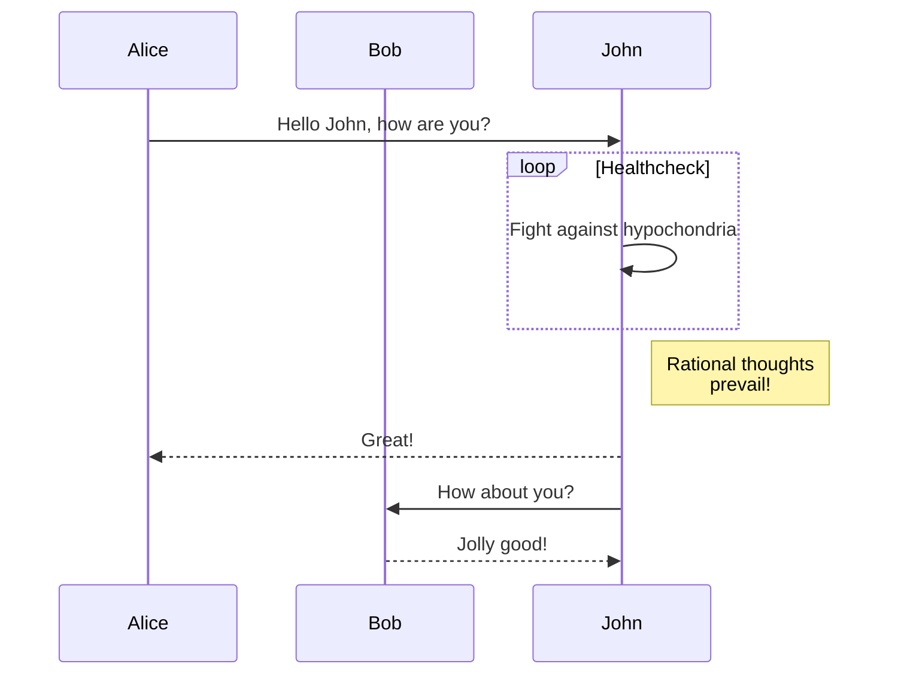
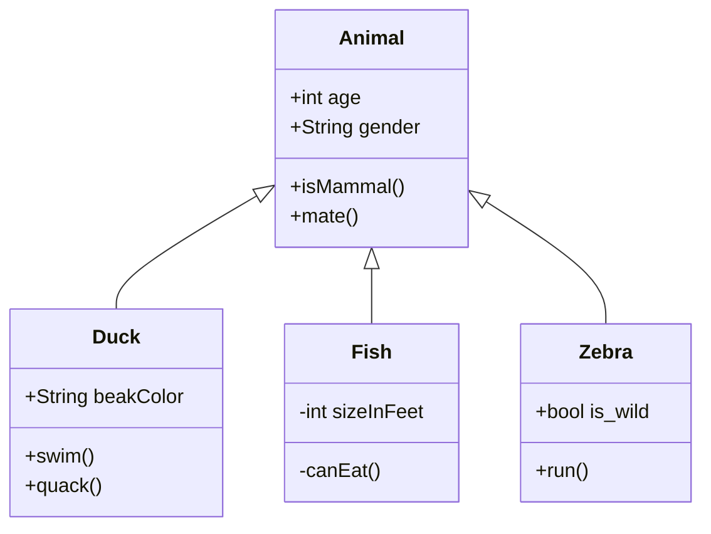
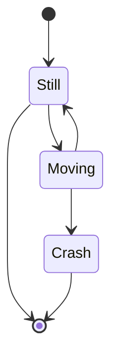
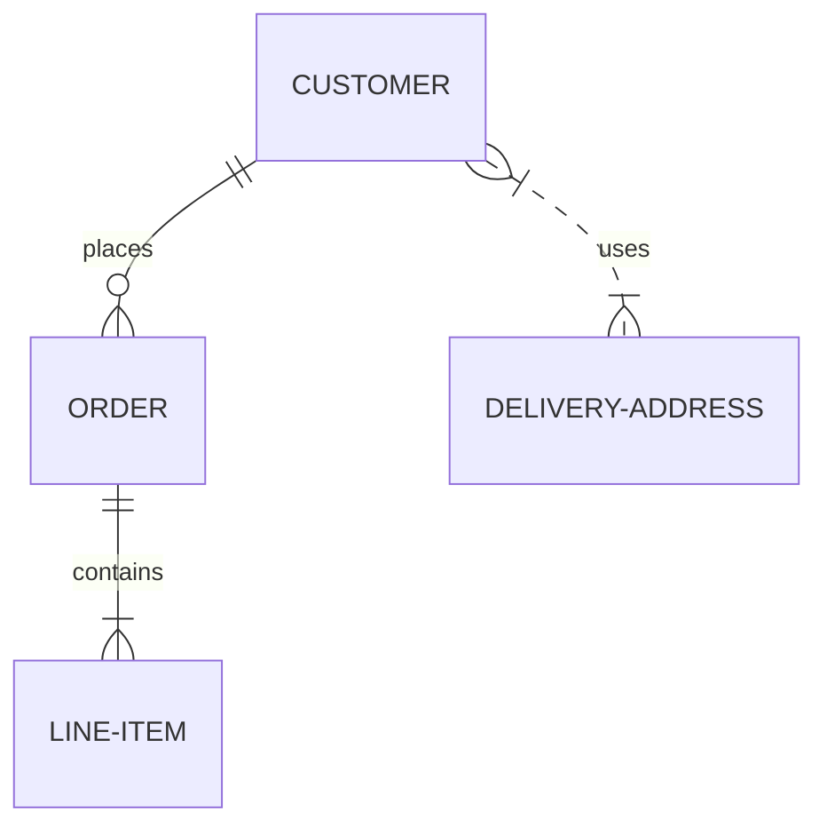
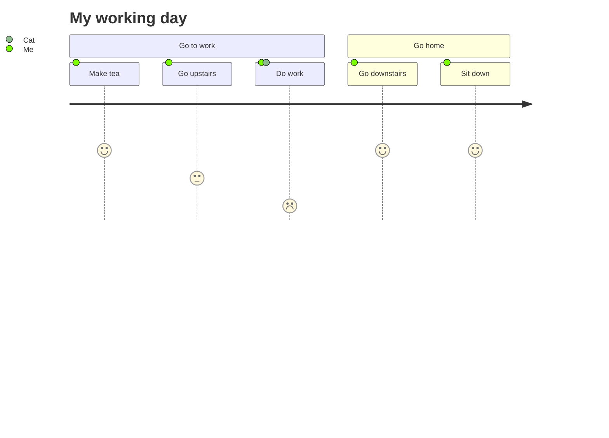
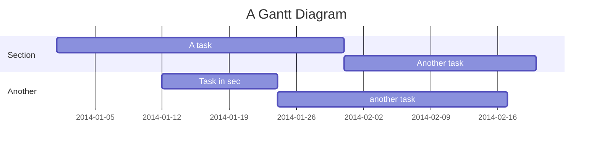
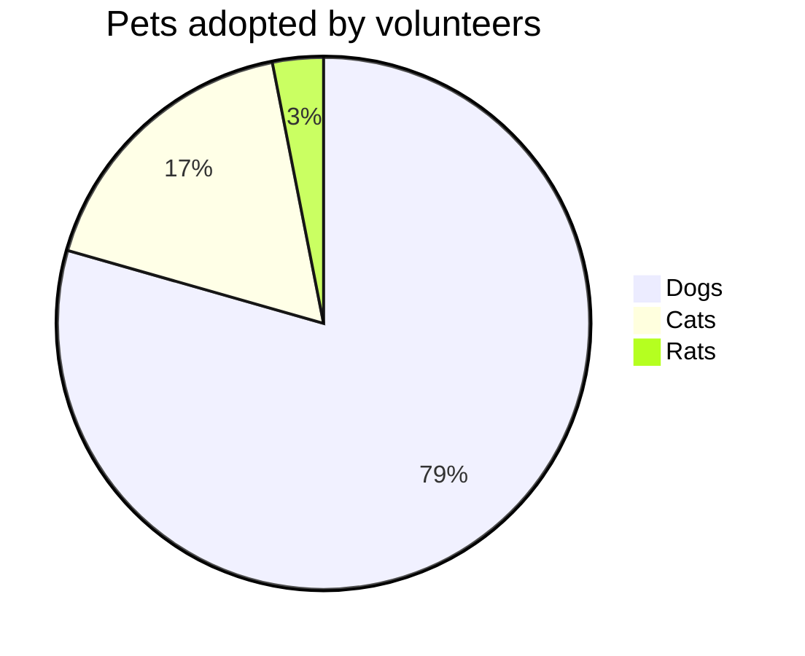
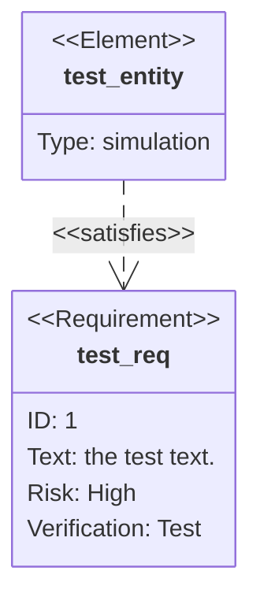

# Mermaid

[Mermaid](https://mermaid-js.github.io/mermaid/) lets you create diagrams and visualizations using text and code.

## Flow Chart

````

````


[More document](https://mermaid-js.github.io/mermaid/#/flowchart)

## Sequence Diagram

````

````


[More document](https://mermaid-js.github.io/mermaid/#/sequenceDiagram)

## Class Diagram

````

````


## State Diagram

````

````


[More document](https://mermaid-js.github.io/mermaid/#/stateDiagram)

## Entity Relationship Diagrams

````

````


[More document](https://mermaid-js.github.io/mermaid/#/entityRelationshipDiagram)

## User Journey

````

````


[More document](https://mermaid-js.github.io/mermaid/#/user-journey)

## Gantt

````

````


[More document](https://mermaid-js.github.io/mermaid/#/gantt)

## Pie Chart

````

````


[More document](https://mermaid-js.github.io/mermaid/#/pie)

## Requirement Diagram

````

````


[More document](https://mermaid-js.github.io/mermaid/#/requirementDiagram)